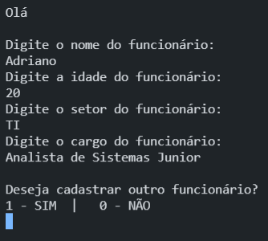
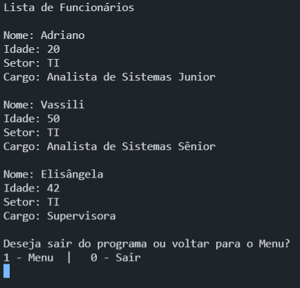

# Listando Funcionários

## Objetivos do Programa

<ul>
<li>Preencher os dados dos funcionários de um setor e formar uma lista com esses dados</li>
</ul>

## Linguagens Utilizadas

<ul>
<li>C#</li>
</ul>

## Programa em Execução

Imagem 1

</img>

Imagem 2

</img>